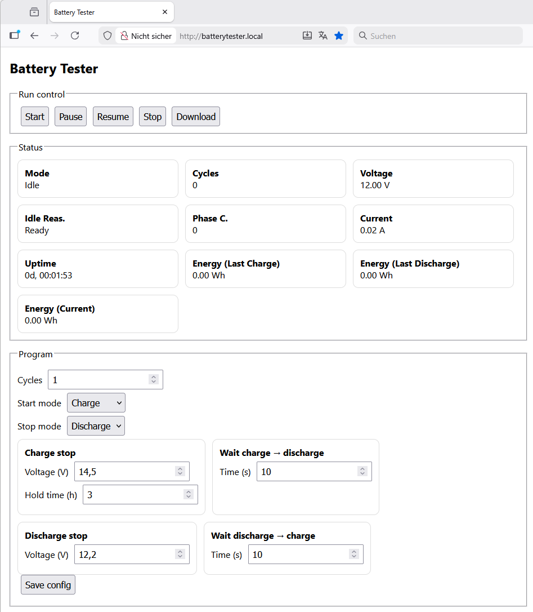
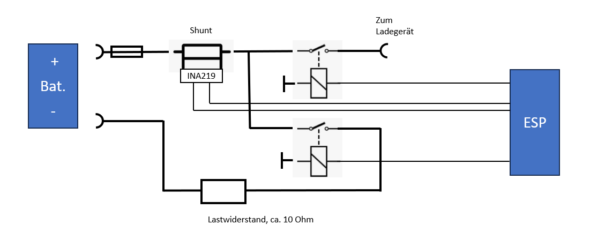
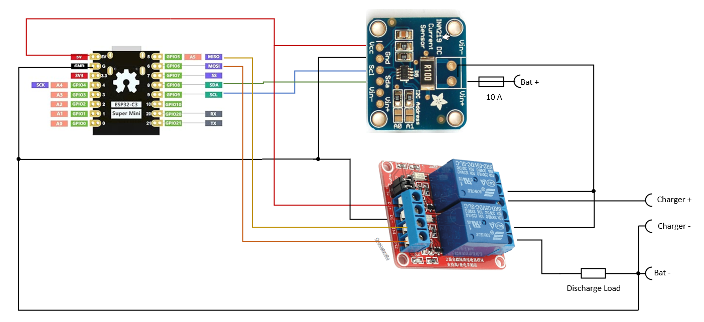

# Battery Capacity Tester (ESP32-C3)

ESP32-based battery capacity tester with charge/discharge cycling, energy integration, HTTP user interface and CSV data export from a RAM ring buffer.

The firmware is designed for long-running measurements (hours to days) with decoupled sampling and logging intervals.

## Features

- Energy measuerements in operation modes Charge / Discharge 
- HTTP-based user interface for control and monitoring
- WiFi with STA mode and automatic AP fallback
- CSV export via HTTP (no filesystem required)
- Decoupled sampling and logging intervals
- Full simulation mode for voltage and current

## Architecture Overview

The firmware is structured into clearly separated modules:

- State Machine  
  Controls operating modes (Idle, Charge, Discharge) and transitions.

- Core Logic  
  Performs periodic sampling, energy integration and stop-condition checks.

- Hardware Abstraction  
  Provides voltage and current readings from real hardware or a simulation backend.

- Log Buffer  
  Stores measurement snapshots in a fixed-size RAM ring buffer and generates CSV output.

- HTTP UI  
  Exposes status information, control commands and CSV download.

## WiFi Behaviour

1. On startup, the device attempts to connect in Station (STA) mode using configured credentials.
2. If the connection is not established within the configured timeout:
   - Station mode is aborted
   - The device starts its own Access Point (AP)
3. AP network parameters (SSID, password, channel, IP, gateway, subnet) are configurable in `config.h`.
4. If enabled, the device announces itself via mDNS under:

   http://batterytester.local

## HTTP Interface

### User Interface

The web UI provides:
- Live system status
- Current mode, phase and cycle counters
- Start / Stop / Mode control
- CSV download of logged measurement data

<figure align="center">

  <figcaption>User interface</figcaption>
</figure>

### Internal API

The HTTP server exposes internal endpoints used by the UI:

- /status  
  Returns current system state as JSON

- /cmd  
  Accepts commands (start, stop, mode selection)

- /csv  
  Triggers CSV export of the log buffer

## Configuration

All user-adjustable parameters are centralized in `config.h`.

- Timing  
  Sampling interval and CSV logging interval are intentionally decoupled.

- Hardware  
  Enable or disable INA219 support and configure charge/discharge GPIOs.

- Simulation  
  Generates voltage and current values in software for testing and UI development.

- WiFi  
  Configure STA credentials, connection timeout and AP parameters.

## Build

Recommended environment: PlatformIO with Arduino framework  
Target platform: ESP32-C3

<!-- -->
<figure align="center">
  
  <figcaption>Circuit</figcaption>
</figure>

<figure align="center">
  
  <figcaption>ESP32 wiring</figcaption>
</figure>

<figure align="center">
  
  <figcaption>First test</figcaption>
</figure>

<!--

-->

## Usage

1. Power the device
2. Connect via configured WiFi or fallback access point
3. Open the web interface (IP from serial log or batterytester.local)
4. Start a charge or discharge cycle
5. Let the measurement run for the desired duration
6. Download the CSV file for analysis

## License

This project is licensed under the MIT License.
See the LICENSE file for details.

Copyright (c) 2025
 
